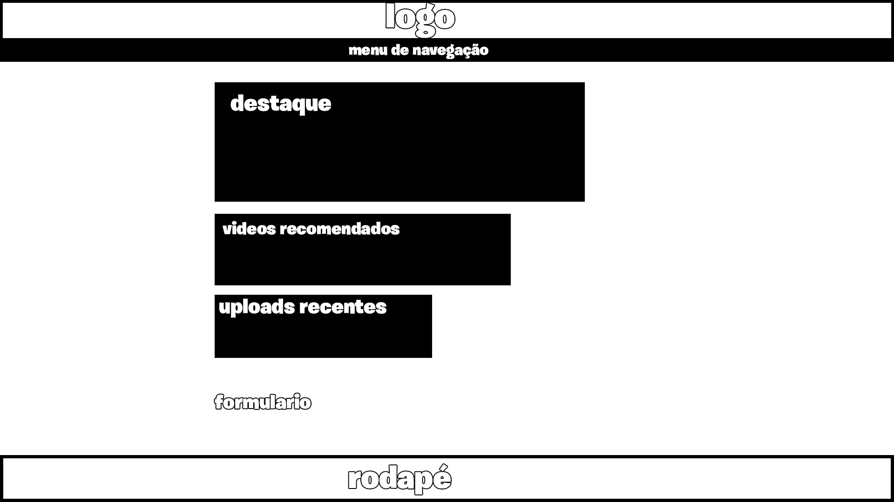

## Informações Gerais

- **Nome:** João Pedro Costa e Silva  
- **Matrícula:** 891500  
- **Proposta de Projeto:** Layout estilo YouTube  
- **Descrição:** Este projeto tem como objetivo reproduzir de forma simples um layout inspirado no YouTube. A home-page é montada de forma dinâmica a partir de uma estrutura JSON, e cada card é um link para uma página de detalhes que exibe mais informações sobre o item selecionado, também gerados dinamicamente.

## WireFrame 

