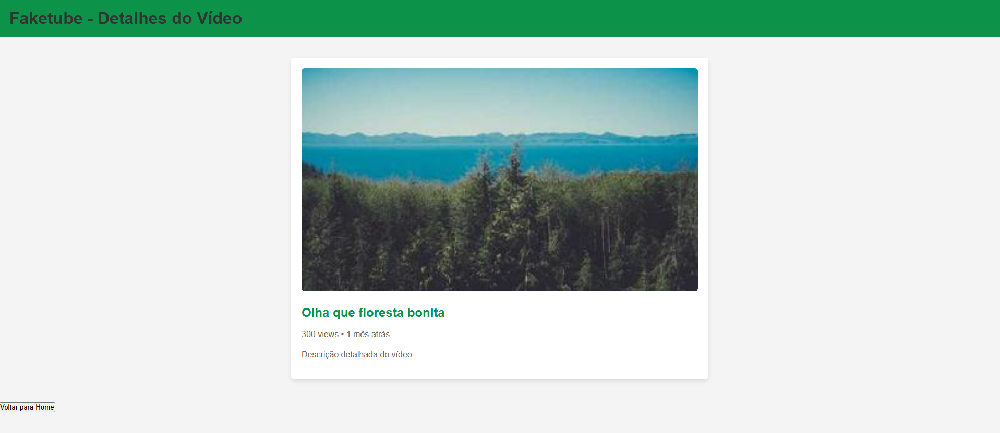

# Trabalho Prático - Semana 07 e 08

Nesta atividade, demos sequência ao projeto iniciado na semana passada, evoluindo o layout estilo YouTube para que a home-page e a página de detalhes funcionem de forma dinâmica, adaptando o conteúdo a partir de dados reais definidos via JSON. Foram implementadas versões responsivas utilizando CSS puro e posteriormente a integração dinâmica entre a home-page e a página de detalhes com JavaScript.

## Informações Gerais

- **Nome:** João Pedro Costa e Silva  
- **Matrícula:** 891500  
- **Proposta de Projeto:** Layout estilo YouTube  
- **Descrição:** Este projeto tem como objetivo reproduzir de forma simples um layout inspirado no YouTube. A home-page é montada de forma dinâmica a partir de uma estrutura JSON, e cada card é um link para uma página de detalhes que exibe mais informações sobre o item selecionado, também gerados dinamicamente.

## Print da Home-Page Dinâmica

## Print da Página de Detalhes do Item

